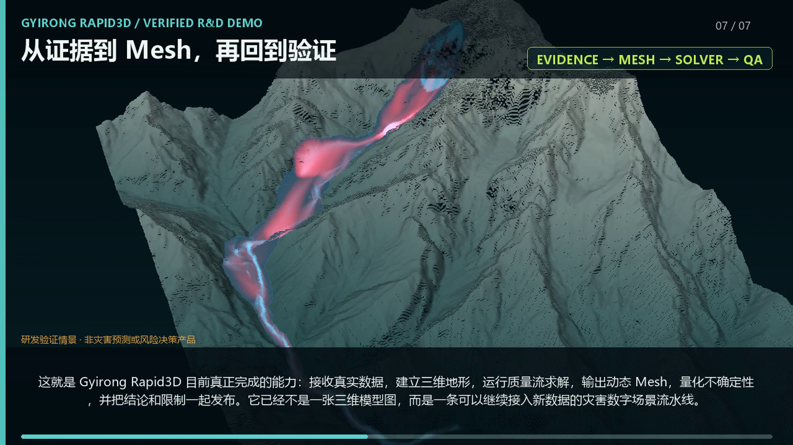
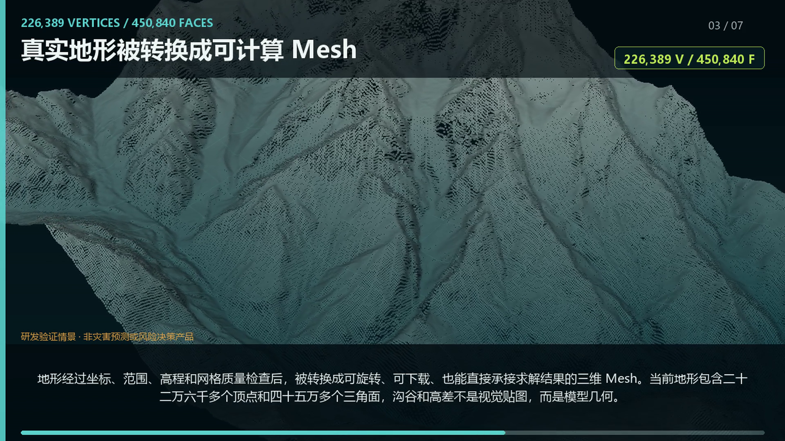
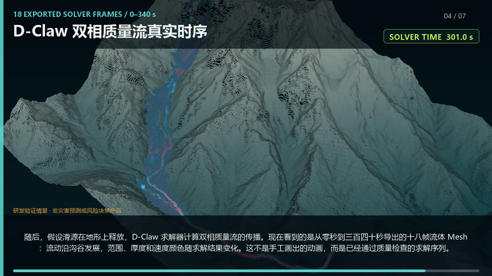
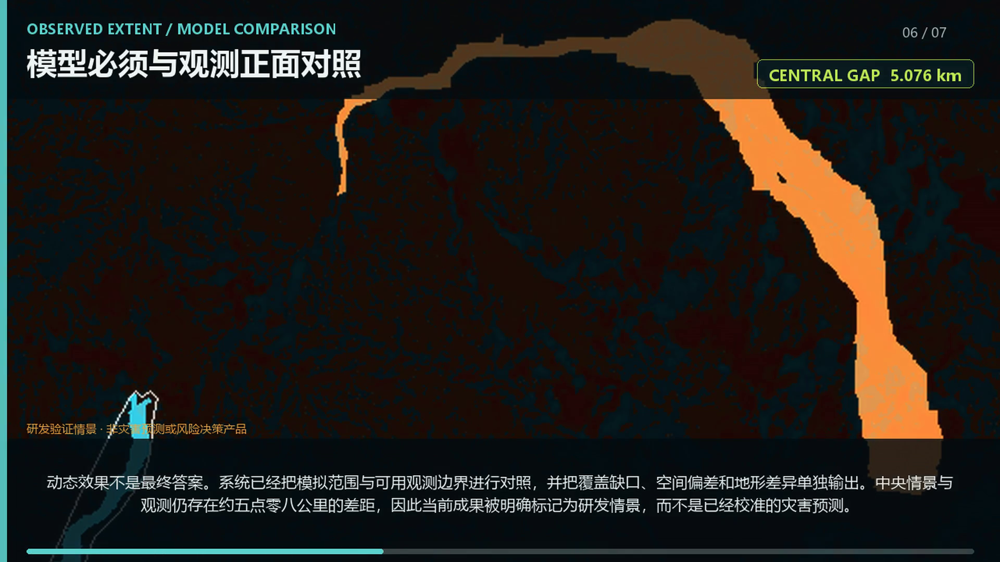

<div align="center">

# Rapid3D GeoHazard

### From terrain and satellite evidence to validated 3D disaster scenes.

**面向山地灾害的证据驱动快速三维重建与物理仿真框架**

[](#current-status)
[](#what-is-built)
[](#what-is-built)
[](#truth-and-confidence)

[完整项目介绍](https://zayne1119.github.io/rapid3d-geohazard/) ·
[观看动态演示](https://zayne1119.github.io/rapid3d-geohazard/#demo) ·
[数据与许可](DATA_AND_LICENSES.md)

</div>



## What is Rapid3D GeoHazard?

Rapid3D GeoHazard is an evidence-aware R&D framework for reconstructing mountain-disaster
scenes from terrain, remote-sensing observations and numerical simulation. It connects the
parts that are usually separated:

```text
event evidence
      ↓
terrain registration and QA
      ↓
3D terrain Mesh
      ↓
mass-flow simulation
      ↓
dynamic Mesh and peak fields
      ↓
observation comparison
      ↓
confidence and limitations
```

The first verified use case is a rapid reconstruction of a 2026 Himalayan cross-border
mountain-disaster corridor. The public repository contains a non-georeferenced project
overview only; raw event data, exact control points and downloadable real-event Mesh assets
are intentionally excluded.

## What is built

| Capability | Implemented result |
|---|---|
| Evidence intake | Source, time, licence, hash, dependency and claim-role tracking |
| Terrain | Metric terrain registration, vertical-datum handling and terrain QA |
| 3D | Standards-based GLB terrain and solver-result Mesh for Web 3D / Blender |
| Physics | D-Claw two-phase mass-flow execution and normalized result export |
| Validation | Model-versus-observation comparison, runout gap and spatial metrics |
| Sensitivity | Release, friction, grid and terrain-information experiments |
| Reliability | Immutable run records, SHA-256 provenance, QA gates and blocked claims |
| Presentation | Interactive Web workspaces, video, figures and evidence release views |

<table>
  <tr>
    <td width="50%"></td>
    <td width="50%"></td>
  </tr>
  <tr>
    <td align="center"><b>Real terrain → computable Mesh</b></td>
    <td align="center"><b>Solver frames → dynamic 3D result</b></td>
  </tr>
</table>

## Verified outputs

- A terrain-review Mesh with **226,389 vertices / 450,840 faces**.
- A D-Claw central sensitivity sequence with **18 exported frames over 0–340 s**.
- Accepted solver runs with maximum mass-creation error kept below the **2% QA gate**.
- Terrain-information experiments at **8 m / 12.5 m / 30 m**.
- Grid-refinement attribution separating solver-grid effects from terrain-detail effects.
- A project-level evidence release linking **15 verified assets and 20 dependencies**.
- **99 automated backend tests**, lint checks and a verified frontend production build.

These are engineering and research-verification results, not operational hazard forecasts.

## Truth and confidence

Rapid3D does not report one vague “accuracy percentage”. Confidence is separated by layer:

| Layer | Current internal evidence score | Meaning |
|---|---:|---|
| Terrain and coordinates | ≈70% | Real registered terrain, but not a 2026 field survey |
| Disaster imagery | ≈65% | Real post-event coverage with cloud and licence limits |
| Disaster evidence | ≈70% | Official and source-linked observations, still incomplete |
| Physical reconstruction | 25–30% | Solver works, but the event fit is not yet calibrated |
| Engineering reliability | ≈90% | Reproducible runs, hashes, schemas, tests and explicit gates |
| Overall event-reconstruction maturity | ≈50% | Internal evidence-maturity score, not probability |

The most important result is a negative one: the central scenario still stops **5.076 km**
short of the current downstream observation, while the high-release sensitivity remains
**3.957 km** short. Current IoU and observation recall are zero. The system preserves this
failure instead of packaging it as a successful prediction.



## Why this is different

Most rapid 3D demos stop at a visually convincing scene. Rapid3D adds four controls:

1. **Every layer has provenance.** Source, timestamp, coordinate frame, licence and hash are
   recorded.
2. **Simulation is not animation.** Flow geometry is exported from numerical solver frames.
3. **Uncertainty becomes an experiment.** Resolution, release, friction and terrain changes
   are compared under controlled conditions.
4. **Failures remain visible.** Unsupported prediction and risk-decision claims stay blocked.

## Technology

Python 3.11+ · NumPy · Rasterio · PyProj · Shapely · Trimesh · JSON Schema · PySTAC ·
D-Claw · GLB/glTF · React · TypeScript · WebGL · Blender-compatible assets

## Current status

`Verified R&D prototype` — terrain, evidence, Mesh, solver, sensitivity, validation and
release-audit chains are operational. This project is **not** an early-warning system,
engineering-design product or calibrated disaster forecast.

## Public repository scope

This repository intentionally publishes the project narrative and non-georeferenced visual
evidence only. It does not contain:

- raw commercial/open-crisis satellite imagery;
- GeoTIFF/DSM/DTM source rasters;
- exact real-event control points or infrastructure coordinates;
- downloadable real-event GLB assets;
- supplier data, credentials or client deliverables.

See [DATA_AND_LICENSES.md](DATA_AND_LICENSES.md) for attribution and use boundaries.

## Project page

The visual project page includes the dynamic demonstration, the implemented pipeline,
verified results and confidence explanation:

**https://zayne1119.github.io/rapid3d-geohazard/**

## Notice

Rapid3D GeoHazard is currently source-visible for project evaluation. A project-level
open-source licence has not yet been selected. No permission to reuse third-party data is
granted by this repository. See [LICENSE](LICENSE) and [DATA_AND_LICENSES.md](DATA_AND_LICENSES.md).

